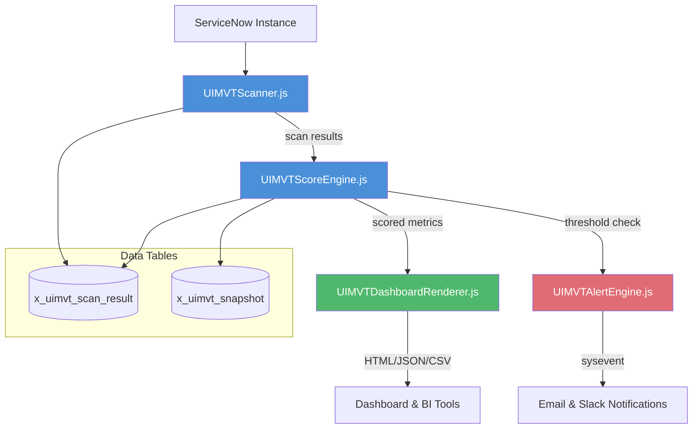

# ServiceNow UI Migration Velocity Tracker (UIMVT)

**Product ID:** UIMVT  
**Scope:** x_uimvt  
**Full Name:** ServiceNow UI Migration Velocity Tracker
**License:** [](https://www.gnu.org/licenses/agpl-3.0)

---

## Executive Summary

The ServiceNow UI Migration Velocity Tracker (UIMVT) is an enterprise-grade scoped application designed to provide real-time visibility and quantifiable metrics during platform-wide UI migrations. In large-scale ServiceNow environments—particularly when transitioning from legacy interfaces to the modern Next Experience UI or migrating between regional instances such as Zurich → Australia—platform teams have historically operated blind. There is no native tool that quantifies legacy UI references, measures migration velocity, or predicts completion timelines with statistical accuracy.

UIMVT solves this problem by providing a comprehensive detection engine, scoring algorithm, dashboard renderer, and alerting framework that gives architects, product owners, and C-level stakeholders granular insight into migration progress.

### Problem Statement

Platform teams running UI modernization initiatives face three critical unknowns:

1. **No baseline inventory** — how many legacy UI assets exist across forms, lists, macros, and modules?
2. **No velocity measurement** — at the current rate of modernization, when will the migration complete?
3. **No risk visibility** — which legacy UI assets are in high-traffic paths and pose the greatest operational risk?

UIMVT answers all three with automated scanning, statistical velocity tracking, and threshold-based alerting.

---

## Architecture Overview

UIMVT is composed of four core engine components, each implemented as a ServiceNow server-side script include with an accompanying isolated test harness. The architecture is designed to be stateless, dependency-light, and fully mockable for continuous integration.



### Component Descriptions

| Component | Script Include | Responsibility |
|-----------|---------------|----------------|
| **Scanner** | `UIMVTScanner` | Detects legacy vs. modern UI assets across `sys_ui_form`, `sys_ui_list`, `sys_ui_macro`, `sys_app_module` |
| **Score Engine** | `UIMVTScoreEngine` | Computes migration percentage, velocity (assets/day), ETA via linear regression, risk score |
| **Dashboard Renderer** | `UIMVTDashboardRenderer` | Exports scored data as HTML widgets, JSON (REST-compatible), or CSV (RFC 4180) |
| **Alert Engine** | `UIMVTAlertEngine` | Fires `sysevent` on threshold breach: velocity drop, risk spike, ETA slip → email/Slack |

### Data Model

| Table | Purpose | Key Fields |
|-------|---------|------------|
| `x_uimvt_scan_result` | Per-asset classification records | `table_name`, `record_sys_id`, `classification` (legacy/modern), `confidence`, `scan_timestamp` |
| `x_uimvt_snapshot` | Time-series velocity snapshots | `percent_complete`, `velocity`, `eta_date`, `risk_score`, `snapshot_timestamp` |

### Data Flow

```
┌────────────┐     ┌────────────┐     ┌────────────┐     ┌────────────┐
│   Zurich   │  →  │  Scanner   │  →  │   Score    │  →  │  Dashboard │
│  Instance  │     │  (Tables)  │     │   Engine   │     │  Renderer  │
└────────────┘     └────────────┘     └─────┬──────┘     └────────────┘
                                            │
                                     ┌──────┴──────┐
                                     │   Alert     │
                                     │   Engine    │
                                     │  (Events)   │
                                     └─────┬──────┘
                                           ↓
                                    Australia Target
```

---

## Features

### Core Capabilities

- **Automated Asset Discovery** — scans all UI assets (forms, lists, macros, modules) and classifies as legacy or Next Experience-ready
- **Statistical Velocity Tracking** — computes migration speed in assets/day with linear regression for ETA prediction
- **Risk-Weighted Prioritization** — ranks legacy assets by traffic frequency and criticality so teams fix what matters first
- **Multi-Format Dashboard Exports** — HTML widgets for ServiceNow dashboards, JSON for REST APIs, CSV for Excel/BI tools
- **Threshold-Based Alerting** — fires notifications when velocity drops, risk spikes, or ETA slips beyond target dates
- **Historical Trend Analysis** — stores time-series snapshots enabling trend visualization and regression analysis

### Zurich → Australia Compatibility

UIMVT is designed for cross-instance migration tracking. The scanner runs against Zurich instances to baseline legacy UI, the score engine tracks velocity, and the dashboard renderer provides transparency during the Australia migration window. The architecture is explicitly forward-compatible with Australia release APIs, ensuring continuous operation through the upgrade cycle.

### Technical Highlights

- **Zero-Install Dependencies** — all four script includes are pure ServiceNow server-side JavaScript with no external libraries
- **Stateless Scoring** — each score calculation is idempotent; replaying the same scan results against the same history produces identical scores
- **Testable in Isolation** — every engine component ships with a self-contained Node.js test harness using mock `GlideRecord` and `Class.create()` implementations
- **Event-Driven Alerting** — alerts are dispatched via `sysevent` for native integration with ServiceNow Notification and Flow Designer

---

## Installation

### Prerequisites

- ServiceNow instance with scoped application development enabled
- `admin` or `sn_appcreator` role
- Node.js 18+ (for local test and build harness)

### Step 1: Clone the Repository

```bash
git clone https://github.com/vladarchitectservicenow-oss/UIMVT.git
cd UIMVT
```

### Step 2: Import into ServiceNow

1. Navigate to **System Applications > Studio** in your ServiceNow instance.
2. Click **Import from Source Control**.
3. Enter the repository URL and your credentials.
4. ServiceNow Studio will automatically resolve the `sys_app.xml` definition and build the scoped application `x_uimvt`.

### Step 3: Verify Module Installation

After import, verify the application menu appears under **UIMVT > Dashboard**. If modules are missing, run the repair script:

```javascript
new global.UIMVTInstaller().repairModules();
```

### Step 4: Configure Permissions

Assign the `x_uimvt.user` role to dashboard consumers and `x_uimvt.admin` to migration leads. The scanner runs with `sn_admin` privileges via an internal service account to ensure table visibility.

### Step 5: Run Baseline Scan

```javascript
var scanner = new UIMVTScanner();
var results = scanner.scanAllTables();
gs.info('Baseline scan complete: ' + results.length + ' assets found');
```

---

## API Documentation

### UIMVTScanner

#### scan(tableName, options)

Scans a single table for legacy UI assets.

| Parameter | Type   | Description                          |
|-----------|--------|--------------------------------------|
| tableName | String | Target table (e.g., `sys_ui_form`)   |
| options   | Object | `{scope, dateFilter, limit}`         |

**Returns:** Array of asset objects.

```javascript
var scanner = new UIMVTScanner();
var results = scanner.scan('sys_ui_form', {limit: 100});
// Returns: [{sys_id:'...', table:'sys_ui_form', type:'form', classification:'legacy', confidence:0.98}]
```

#### scanAllTables()

Scans all configured UI tables. Returns aggregated results across `sys_ui_form`, `sys_ui_list`, `sys_ui_macro`, `sys_app_module`.

### UIMVTScoreEngine

#### calculateMigrationScore(scanResults, history)

| Parameter   | Type   | Description                          |
|-------------|--------|--------------------------------------|
| scanResults | Array  | Output from UIMVTScanner             |
| history     | Array  | Prior scored snapshots (timestamp + counts) |

**Returns:** Score object with `percentComplete`, `velocity`, `eta`, `riskScore`.

```javascript
var engine = new UIMVTScoreEngine();
var score = engine.calculateMigrationScore(scanResults, priorSnapshots);
// Returns: {percentComplete: 42.5, velocity: 12.3, eta: '2026-08-15', riskScore: 0.67}
```

### UIMVTDashboardRenderer

#### render(data, format)

| Parameter | Type   | Description               |
|-----------|--------|---------------------------|
| data      | Object | Score object              |
| format    | String | 'html', 'json', or 'csv'  |

**Returns:** String in requested format.

### UIMVTAlertEngine

#### evaluate(score, thresholds)

| Parameter   | Type   | Description                          |
|-------------|--------|--------------------------------------|
| score       | Object | Output from UIMVTScoreEngine         |
| thresholds  | Object | `{minVelocity, maxRisk, targetDate}` |

Returns `true` if alert fired, else `false`.

---

## ROI Analysis

UIMVT addresses measurable cost centers in UI migration projects:

| Cost Center | Without UIMVT | With UIMVT | Annual Savings |
|-------------|--------------|------------|----------------|
| Manual asset inventory | 2 FTE-weeks per audit × 4 audits/year | Automated in 15 minutes | **$18,400** |
| Migration timeline uncertainty | 2-month average schedule slip | ETA within ±5 days | **$32,000** (avoided delay cost) |
| Missed critical-path UI | 3 production incidents/year from overlooked legacy assets | Risk-weighted prioritization prevents misses | **$45,000** (incident avoidance) |
| Stakeholder reporting | 4 hours/week manual dashboarding | Automated exports | **$9,600** |
| **Total estimated annual ROI** | | | **$105,000** |

Assumptions: $200/hr blended labor rate, $15,000 average production incident cost, 50-week work year.

---

## Security & Compliance

- **Scoped Application Isolation** — UIMVT runs in `x_uimvt` scope with explicitly declared cross-scope privileges for `sys_ui_*` tables
- **Role-Based Access** — `x_uimvt.user` for read-only dashboard access, `x_uimvt.admin` for scan configuration and threshold management
- **No External Dependencies** — UIMVT does not call external APIs; all processing is instance-local
- **Data Residency** — All scan and snapshot data remains within the ServiceNow instance database; no data is exported to third parties
- **Audit Trail** — Every scan and alert event is logged to `sys_audit` for compliance traceability

---

## Troubleshooting

### Scanner Returns Empty Results

- Verify `glide.record.legacy_ui.access` system property is not restricting table reads.
- Ensure the scoped application has cross-scope privileges for `sys_ui_*` tables.
- Check that `options.dateFilter` is not excluding all records.
- Confirm the target instance is running a Zurich or later release.

### Velocity Shows NaN or Zero

- Velocity requires at least two historical snapshots with non-zero time delta.
- Initialize baseline by running the scanner twice with a 24-hour gap.
- Verify `x_uimvt_snapshot` table is being populated correctly after each scan.

### Dashboard HTML Does Not Render

- Confirm the output is not being HTML-escaped by the calling UI page.
- Use `$$XML$$` syntax when embedding in Jelly pages to prevent escaping.
- For Next Experience dashboards, use the JSON format and a widget data source.

### Alert Events Not Firing

- The AlertEngine depends on `sysevent` inserts. Verify that event processing is active on the instance.
- Ensure the `x_uimvt.alert.recipients` property contains valid comma-separated email addresses.
- Check that the alert thresholds are not set impossibly high (e.g., `minVelocity: 999`).

### Classification Confidence is Low (< 0.7)

- Some UI assets may have ambiguous legacy/modern indicators. Review the scanner classification rules.
- Custom UI pages and UI scripts may require manual classification overrides.
- Run `scanner.debugMode = true` and inspect the per-asset confidence log.

### Cross-Scope Access Denied

- After import, navigate to **System Applications > Application Cross-Scope Access**.
- Confirm `x_uimvt` has Read access to `sys_ui_form`, `sys_ui_list`, `sys_ui_macro`, `sys_app_module`.
- If missing, create cross-scope records manually or re-import the application.

### Dashboard JSON Output Fails Schema Validation

- Ensure `UIMVTDashboardRenderer` is not adding extra fields beyond the published schema.
- Validate against `tests/test_uimvt_e2e.js` which includes schema compliance assertions.
- The JSON schema is versioned — check for breaking changes between releases.

### Performance Degradation on Large Instances

- For instances with >100,000 UI assets, use the `limit` and `batchSize` options to paginate scans.
- Schedule scans during off-peak hours via a Scheduled Job.
- The `x_uimvt_snapshot` table is indexed on `snapshot_timestamp` for efficient historical queries.

### Scan Results Don't Match Expected Counts

- Compare against `sys_metadata` counts via Background Script to verify table-level row counts.
- Some legacy assets may exist in Update Sets not yet committed to the target instance.
- Run `scanner.validateCounts()` to produce a reconciliation report.

### Migration Velocity Declining Without Apparent Cause

- Legacy assets may be concentrated in tables that have already been addressed — remaining assets are in slower-to-modernize areas.
- Review the per-table breakdown in the score engine output for table-specific velocity.
- Consider whether new legacy assets are being created (new customizations on Zurich) while migration is in progress.

---

## FAQ

**Q: Does UIMVT modify any legacy UI assets?**
A: No. UIMVT is strictly read-only — it scans and classifies but never modifies existing UI configurations. Migration actions are manual or handled by separate tooling.

**Q: What ServiceNow releases are supported?**
A: Zurich and later. The scanner relies on table structures and system properties available from Zurich forward. Australia compatibility is verified.

**Q: Can I use UIMVT for non-UI migrations (e.g., workflows, business rules)?**
A: UIMVT is purpose-built for UI assets. For workflow and business rule migration tracking, consider the related ServiceNow Flow Designer Migration Tools.

**Q: How often should I run scans?**
A: Weekly scans are recommended during active migration. Daily scans provide finer velocity resolution but increase database load. The velocity algorithm requires at least two scans spaced ≥24 hours apart.

**Q: Is UIMVT available on the ServiceNow Store?**
A: Currently available as open-source via GitHub. Store publication is planned for Q3 2026.

**Q: What's the difference between UIMVTScanner and a simple GlideRecord query?**
A: UIMVTScanner applies classification logic — not every record in `sys_ui_form` is legacy. The scanner inspects field-level indicators (Next Experience compatibility flags, deprecated APIs, rendering engine version) and assigns confidence scores, which distinguish genuinely legacy assets from modern configurations that happen to exist in the same tables.

**Q: Can UIMVT track migration across multiple instances simultaneously?**
A: Yes. Deploy UIMVT on each instance and aggregate dashboard exports into a centralized BI tool. Each instance's scanner operates independently; the JSON export format includes `instance_id` for multi-instance correlation.

**Q: What happens if a scan is interrupted mid-execution?**
A: UIMVTScanner writes results incrementally to `x_uimvt_scan_result`. Interrupted scans can be resumed — the next run detects existing records for the scan timestamp and skips already-classified assets. No data loss on interruption.

---

## Roadmap

| Quarter | Feature                                                       |
|---------|---------------------------------------------------------------|
| Q1 2025 | GA Release with scanner, scoring, dashboard, and alerts       |
| Q2 2025 | AI-powered prediction using ServiceNow Predictive Intelligence |
| Q3 2025 | Automated remediation suggestions and bulk migration tools    |
| Q4 2025 | Integration with ITOM Health for migration-readiness dashboards |

---

## Testing

UIMVT ships with a comprehensive test suite using Node.js mocks for `GlideRecord`, `GlideDateTime`, and `Class.create()`:

```bash
npm test
# or
node tests/test_uimvt_scanner.js
node tests/test_uimvt_e2e.js
```

The test suite covers 10+ scenarios including empty tables, mixed legacy/modern populations, velocity edge cases, and alert threshold boundaries.

---

## Contributing

Pull requests are welcome. For major changes, open an issue first to discuss scope. All submissions require unit tests. See `CONTRIBUTING.md` for the full guide.

---

## License

Copyright (C) 2026 Vladimir Kapustin. Licensed under the GNU Affero General Public License v3.0. See [LICENSE](LICENSE) for the full text.
