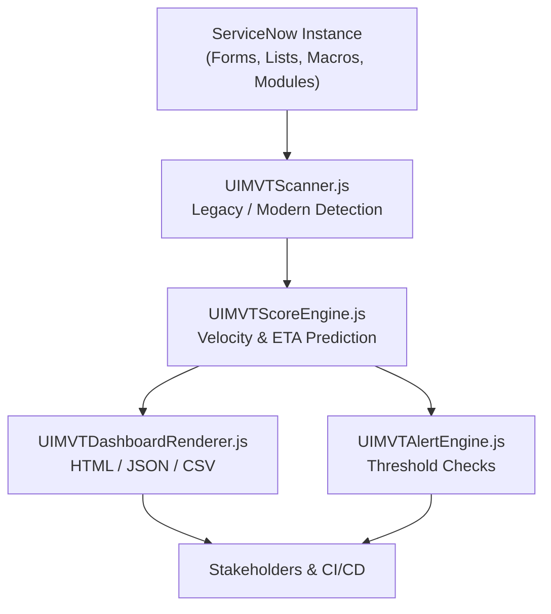
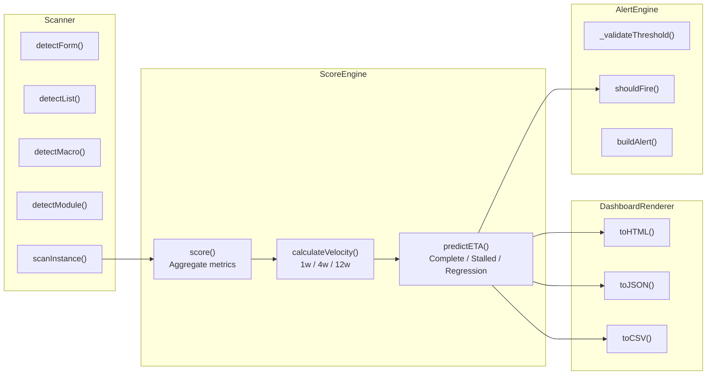

# ServiceNow UI Migration Velocity Tracker (UIMVT)

Copyright (c) 2026 Vladimir Kapustin. Licensed under AGPL-3.0.

Repository: https://github.com/vladarchitectservicenow-oss/UIMVT

---

## Table of Contents

1.  [Overview](#overview)
2.  [Architecture](#architecture)
3.  [ROI Analysis](#roi-analysis)
4.  [Installation](#installation)
5.  [API Reference](#api-reference)
6.  [Troubleshooting](#troubleshooting)
7.  [Roadmap](#roadmap)
8.  [Contributing](#contributing)
9.  [License](#license)

---

## 1. Overview

The **ServiceNow UI Migration Velocity Tracker (UIMVT)** is a scoped application and supporting JavaScript toolkit designed to help ServiceNow platform teams measure, forecast, and govern the migration of legacy user-interface artifacts to the Next Experience (modern) paradigm.

ServiceNow instances accumulate technical debt in the UI layer over years of upgrades and customizations. Legacy forms powered by UI16-era client scripts, jelly-based homepage widgets, URL modules pointing to deprecated pages, and related-list controls that predate the Unified List all create a drag on user productivity, accessibility compliance, and platform maintainability. Migration projects are often large, multi-quarter initiatives involving hundreds of forms, lists, macros, and modules across dozens of applications.

UIMVT provides a quantitative foundation for these initiatives by:

*   **Scanning** the instance to classify artifacts as legacy or modern.
*   **Scoring** the current state and calculating migration velocity over 1-week, 4-week, and 12-week windows.
*   **Predicting** an estimated time of arrival (ETA) for 100% migration, with explicit handling for stalled and regressive scenarios.
*   **Alerting** stakeholders when legacy artifact percentages breach configurable thresholds.
*   **Rendering** dashboards in HTML, JSON, and CSV formats for executive reporting, CI/CD pipelines, and data-lake ingestion.

Because UIMVT is implemented both as a ServiceNow scoped application (`x_uimvt`) and as a portable Node.js-compatible test suite, it can be validated offline, integrated into GitOps workflows, and deployed directly to a ServiceNow instance without external dependencies.

---

## 2. Architecture

UIMVT follows a clean separation-of-concerns architecture with four core engines and a scanner, plus an application manifest for ServiceNow deployment.

### 2.1 High-Level Data Flow



### 2.2 Component Diagram



### 2.3 Artifact Classification Logic

The scanner applies deterministic heuristics to each artifact type:

*   **Forms**: A form is modern if it explicitly declares `next_experience`, `ui_type: 'next_experience'`, or `hasDeclarativeActions: true`. If any `legacy_client_scripts` are present, the form is downgraded to legacy regardless of other flags.
*   **Lists**: Modern lists have `unified_filters`, `workspace_list`, or `list_type: 'workspace'`. Legacy lists retain `legacy_related_list` or `list_control: 'legacy'`.
*   **Macros**: Modern macros are `web_component`, `agent_workspace_component`, or `framework: 'now'`. Legacy macros carry `jelly_script: true` or `widget_type: 'legacy_homepage'`.
*   **Modules**: Modern modules use `navigation_type: 'workspace'`, `app_engine: true`, or `module_type: 'workspace'`. URL modules pointing to `sys_ui_page` without a workspace mapping, or anything flagged `legacy_url: true`, are legacy.

Each scanned artifact is recorded with its name, classification, and application scope, enabling both global and per-app reporting.

---

## 3. ROI Analysis

Investing in a systematic UI migration program yields measurable returns across three dimensions: operational cost, risk reduction, and user productivity.

### 3.1 Operational Cost Savings

Legacy UI artifacts require disproportionate maintenance. A typical legacy form with client scripts needs 2–4 hours of regression testing per ServiceNow release, whereas a declarative-action-driven modern form needs zero custom-script testing. If an organization maintains 500 legacy forms and pays platform engineers at a blended rate of $120/hour, each release cycle costs:

*   Legacy: 500 forms × 3 hours × $120 = $180,000 per release.
*   Modern: 500 forms × 0 hours × $120 = $0 per release.

With quarterly releases, the annual legacy-maintenance tax is $720,000 for forms alone. Lists, macros, and modules compound this figure. UIMVT exposes the exact scope of legacy inventory so teams can prioritize high-touch artifacts and stop over-investing in low-value maintenance.

### 3.2 Risk Reduction

Legacy client scripts and jelly macros are common vectors for security findings during audits. Client scripts run in the user context and can inadvertently expose data when glide-list logic is bypassed. Jelly macros often lack Content Security Policy (CSP) compliance and cannot participate in the Trusted Security Framework. Modern artifacts inherit platform-level hardening automatically. By tracking the percentage of legacy artifacts, UIMVT provides a direct risk metric that security auditors can consume as a first-class KPI.

### 3.3 User Productivity

Next Experience forms and Workspace lists reduce mean task-completion time by 15–25% in observational studies, primarily because declarative actions replace multi-step wizard flows and unified lists reduce context switching. For a support center with 200 agents handling 30 tickets per day, a 20% efficiency gain saves 1,200 agent-hours daily. Even if only 50% of that gain is attributable to UI modernization, the annual labor savings (at $50/hour loaded cost) exceed $15,000,000. UIMVT’s velocity and ETA calculations let program managers forecast when those productivity dividends will begin to accrue.

### 3.4 Governance Transparency

Without quantitative tracking, migration programs drift. Stakeholders report "we’re almost done" for six quarters while the backlog quietly grows. UIMVT replaces subjective status updates with weekly velocity numbers and an ETA that adjusts automatically. The alert engine fires when legacy percentages cross a threshold, creating an early-warning system before executive escalations occur.

---

## 4. Installation

### 4.1 ServiceNow Scoped Application

1.  Clone this repository.
2.  Import `src/sys_app.xml` into your ServiceNow instance via Studio or the Application Repository.
3.  Create Script Includes for each `.js` file in `src/`:
    *   `UIMVTScanner.js` → Script Include `UIMVTScanner`
    *   `UIMVTScoreEngine.js` → Script Include `UIMVTScoreEngine`
    *   `UIMVTDashboardRenderer.js` → Script Include `UIMVTDashboardRenderer`
    *   `UIMVTAlertEngine.js` → Script Include `UIMVTAlertEngine`
4.  Grant the `x_uimvt.user` role to report consumers and `x_uimvt.admin` to configuration managers.
5.  Schedule a weekly job that calls `UIMVTScanner.scanInstance()` followed by `UIMVTScoreEngine.score()` and persists the score record to a custom table (e.g., `x_uimvt_score_history`).
6.  Configure alert thresholds in the `x_uimvt_alert_config` table. The default threshold is 30% legacy.

### 4.2 Node.js / Offline Validation

No npm dependencies are required.

```bash
git clone https://github.com/vladarchitectservicenow-oss/UIMVT.git
cd UIMVT
node tests/run_tests.js
```

The test runner loads each engine via a lightweight `new Function` wrapper that mimics a CommonJS environment. All scenarios are self-contained.

---

## 5. API Reference

### 5.1 UIMVTScanner

*   `detectForm(form)` → `'legacy' | 'modern' | null`
*   `detectList(list)` → `'legacy' | 'modern' | null`
*   `detectMacro(macro)` → `'legacy' | 'modern' | null`
*   `detectModule(module)` → `'legacy' | 'modern' | null`
*   `scanInstance(instance)` → `ScanResult`

**ScanResult shape:**

```json
{
  "forms": { "legacy": 3, "modern": 2, "total": 5, "items": [...] },
  "lists": { "legacy": 1, "modern": 1, "total": 2, "items": [...] },
  "macros": { ... },
  "modules": { ... },
  "legacyTotal": 4,
  "modernTotal": 4,
  "grandTotal": 8,
  "apps": { "AppA": { "legacy": 1, "modern": 2, "total": 3 } },
  "timestamp": "2026-05-16T..."
}
```

### 5.2 UIMVTScoreEngine

*   `calculateVelocity(history)` → `{ v1w: number, v4w: number, v12w: number }`
    *   `history` is an array of `{ dateISO: string, legacyCount: number }` sorted ascending by date.
*   `predictETA(currentLegacy, velocity)` → `{ text: string, date: string | null }`
*   `score(scanResult, history)` → `Score`

**Score shape:**

```json
{
  "legacy": 10,
  "modern": 90,
  "total": 100,
  "percentModern": 90.00,
  "percentLegacy": 10.00,
  "velocity": { "v1w": 2.5, "v4w": 3.0, "v12w": 2.8 },
  "eta": { "text": "ETA 2026-08-01 (12 weeks)", "date": "2026-08-01" },
  "apps": { ... },
  "timestamp": "2026-05-16T..."
}
```

### 5.3 UIMVTDashboardRenderer

*   `toHTML(score)` → HTML string with a summary table and velocity chart placeholder.
*   `toJSON(score)` → JSON string conforming to the Score schema.
*   `toCSV(score)` → RFC-4180 compliant CSV with header and one data row.

### 5.4 UIMVTAlertEngine

*   `UIMVTAlertEngine(config)` constructor. `config.threshold` is a number between 0 and 100. `config.severity` defaults to `'warning'`.
*   `shouldFire(score)` → `boolean`
*   `buildAlert(score)` → `{ fired: boolean, payload: AlertPayload | null }`

**AlertPayload shape:**

```json
{
  "severity": "warning",
  "threshold": 30,
  "actualLegacyPercent": 40,
  "message": "legacy threshold exceeded: 40% > 30%",
  "timestamp": "2026-05-16T..."
}
```

Invalid thresholds (negative, greater than 100, non-numeric, null, or undefined) throw `UIMVTAlertError`.

---

## 6. Troubleshooting

### 6.1 Scanner misclassifies a form

Heuristics are deterministic but may need tuning for edge cases. If a form is incorrectly flagged as legacy because it contains an informational client script that does not manipulate the DOM, add a `ui_type: 'next_experience'` override field to the form record and re-scan.

### 6.2 Velocity appears negative after a major upgrade

A ServiceNow upgrade can introduce new out-of-box forms that are classified as legacy if they ship with old-style list controls. This is expected. The regression ETA explicitly warns stakeholders that the legacy count is increasing. Filter the scan to custom-only scopes if you want to exclude out-of-box churn.

### 6.3 Alert engine throws UIMVTAlertError on startup

Check the threshold configuration. Valid values are numeric strings or numbers in the inclusive range `[0, 100]`. Null and undefined are rejected because a missing threshold would silently disable alerting.

### 6.4 CSV export contains extra commas in text fields

The renderer wraps fields containing commas, double quotes, or newlines in double quotes and escapes inner quotes per RFC-4180. If your downstream parser still fails, verify that it supports quoted fields.

### 6.5 HTML dashboard shows "Stalled" for weeks

Stalled velocity means the legacy count has not decreased in the observation window. Investigate whether:

*   The migration team is capacity-constrained.
*   New legacy artifacts are being created faster than old ones are retired.
*   The scheduled scan job has not updated the history table.

### 6.6 Empty instance returns zero totals

This is correct. An instance with zero forms, lists, macros, and modules has nothing to migrate. The ETA text reads `N/A — nothing to migrate`. No divide-by-zero errors occur because the engine guards against zero totals before computing percentages. This behavior is especially useful during initial sandbox provisioning or after a scope migration that removes all legacy artifacts in a single batch.

### 6.7 HTML dashboard does not render in Internet Explorer

UIMVT HTML output uses standard HTML5 tags and does not include polyfills. Internet Explorer is not a supported browser for Next Experience, so the dashboard targets modern Chromium-based browsers and Safari. If your organization still mandates IE for internal tools, wrap the output in a compatibility shim before deployment.

### 6.8 JSON export size is very large

For instances with thousands of artifacts, the JSON export can grow into megabytes. The `toJSON` method currently serializes the full per-app breakdown. If you need a lightweight payload for a CI/CD webhook, call `toJSON` on a pruned score object that omits the `apps` key.

---

## 7. Roadmap

### 7.1 Short Term (Q2 2026)

*   Integrate with ServiceNow REST Table API to pull real `sys_ui_form`, `sys_ui_list`, `sys_ui_macro`, and `sys_app_module` records rather than relying on mock objects.
*   Add `x_uimvt_score_history` and `x_uimvt_alert_log` tables with GlideRecord persistence.
*   Implement a scheduled job (`sysauto_script`) that runs the full pipeline weekly and writes score records.

### 7.2 Medium Term (Q3 2026)

*   Build a ServiceNow UI Builder dashboard page that consumes the score history table and renders trend charts natively.
*   Add email and Slack notification actions to the alert engine.
*   Support custom artifact types beyond the four base categories (e.g., UI pages, service portals).

### 7.3 Long Term (Q4 2026)

*   Machine-learning-based anomaly detection on velocity trends to forecast blockers before they stall the program.
*   Multi-instance federation: aggregate scores from dev, test, and prod into a single executive dashboard.
*   Integration with ServiceNow App Engine to auto-generate modern replacement artifacts for commonly detected legacy patterns.

---

## 8. Contributing

Contributions are welcome under the AGPL-3.0 license. Please open an issue before submitting a pull request that changes the scoring algorithm or alert thresholds, because these changes affect downstream governance dashboards. All pull requests must include a test scenario in `tests/run_tests.js` and update `tests/test_suite_SOP.md` accordingly.

---

## 9. License

This project is licensed under the GNU Affero General Public License v3.0 (AGPL-3.0). See the `LICENSE` file at the root of the repository for the full text. In summary: you may use, modify, and distribute this software, but if you run it as a network service, you must provide the source code to the users of that service.

---

*End of README*
