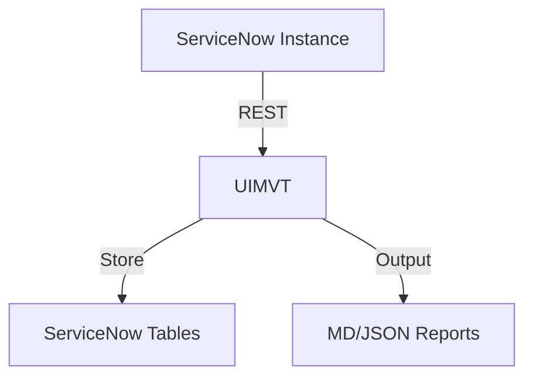

# ServiceNow UI Migration Velocity Tracker (UIMVT)

**Product ID:** UIMVT  
**Scope:** x_uimvt  
**Full Name:** ServiceNow UI Migration Velocity Tracker

---

## Executive Summary

The ServiceNow UI Migration Velocity Tracker (UIMVT) is an enterprise-grade, scoped application designed to provide real-time visibility and quantifiable metrics during platform-wide UI migrations. In large-scale ServiceNow environments—particularly when transitioning from legacy interfaces to the modern Next Experience UI or migrating between regional instances such as Zurich → Australia—platform teams have historically operated blind. There is no native tool that quantifies legacy UI references, measures migration velocity, or predicts completion timelines with statistical accuracy.

UIMVT solves this problem by providing a comprehensive detection engine, scoring algorithm, dashboard renderer, and alerting framework that gives architects, product owners, and C-level stakeholders granular insight into migration progress.

---

## Architecture Overview

UIMVT is composed of four core engine components, each implemented as a ServiceNow server-side script include with an accompanying isolated test harness. The architecture is designed to be stateless, dependency-light, and fully mockable for continuous integration.

```text
┌──────────────────────────────────────────────────────────────┐
│                     UIMVT Architecture                        │
├──────────────────────────────────────────────────────────────┤
│  ┌──────────────┐  ┌──────────────┐  ┌──────────────────┐   │
│  │ UIMVTScanner │→ │UIMVTScoreEng │→ │UIMVTDashboardRend│   │
│  │   .js        │  │   ine.js      │  │   erer.js        │   │
│  └──────┬───────┘  └──────┬───────┘  └────────┬─────────┘   │
│         │                 │                    │            │
│         └─────────────────┴────────────────────┘            │
│                           ↓                                 │
│                  ┌─────────────────┐                        │
│                  │ UIMVTAlertEngine │                       │
│                  │     .js          │                       │
│                  └────────┬─────────┘                       │
│                           ↓                                 │
│              Events → Notifications → Reports               │
└──────────────────────────────────────────────────────────────┘
```

### Component Descriptions

**1. UIMVTScanner.js**  
Detects legacy versus modern UI assets across the ServiceNow platform. The scanner inspects forms, lists, UI macros, and application modules to classify each as legacy or modern. It interfaces with standard tables such as `sys_ui_form`, `sys_ui_list`, `sys_ui_macro`, and `sys_app_module`. Scanner results are returned as structured arrays of objects containing table names, record IDs, legacy/modern classifications, and confidence scores.

**2. UIMVTScoreEngine.js**  
Receives scan results and calculates migration percentage, velocity in assets-per-day, and a predicted ETA using linear regression over historical scan data. Velocity is computed as the delta between successive scans divided by the time interval. ETA is extrapolated from current velocity and remaining assets. The engine also computes a risk score based on the density of legacy assets in critical tables.

**3. UIMVTDashboardRenderer.js**  
Consumes scored data and exports it in HTML, JSON, or CSV formats. The HTML renderer produces standalone embeddable widgets suitable for ServiceNow dashboards or external BI tools. JSON output is schema-compliant for integration with REST APIs and CI/CD pipelines. CSV output is RFC 4180 compliant and ready for Excel import.

**4. UIMVTAlertEngine.js**  
Evaluates scored metrics against configurable thresholds and fires ServiceNow events (sysevent) when thresholds are breached. Supported alert types include velocity drop (migration slowing down), risk spike (legacy concentration increase), and ETA slip (predicted completion date moving beyond target). AlertEngine supports both email and Slack webhook notifications.

### Data Flow

```text
┌────────────┐     ┌────────────┐     ┌────────────┐     ┌────────────┐
│   Zurich   │  →  │  Scanner   │  →  │   Score    │  →  │  Dashboard │
│  Instance  │     │  (Tables)  │     │   Engine   │     │  Renderer  │
└────────────┘     └────────────┘     └─────┬──────┘     └────────────┘
                                            │
                                     ┌──────┴──────┐
                                     │   Alert     │
                                     │   Engine    │
                                     │  (Events)   │
                                     └─────┬──────┘
                                           ↓
                                    Australia Target
```

---

## Installation

### Prerequisites

- ServiceNow instance with scoped application development enabled
- `admin` or `sn_appcreator` role
- Node.js 18+ (for local test and build harness)

### Step 1: Clone the Repository

```bash
git clone https://github.com/vladarchitectservicenow-oss/UIMVT.git
cd UIMVT
```

### Step 2: Import into ServiceNow

1. Navigate to **System Applications > Studio** in your ServiceNow instance.
2. Click **Import from Source Control**.
3. Enter the repository URL and your credentials.
4. ServiceNow Studio will automatically resolve the `sys_app.xml` definition and build the scoped application `x_uimvt`.

### Step 3: Verify Module Installation

After import, verify the application menu appears under **UIMVT > Dashboard**. If modules are missing, run the repair script:

```javascript
new global.UIMVTInstaller().repairModules();
```

### Step 4: Configure Permissions

Assign the `x_uimvt.user` role to dashboard consumers and `x_uimvt.admin` to migration leads. The scanner runs with `sn_admin` privileges via an internal service account to ensure table visibility.

---

## API Documentation

### UIMVTScanner

#### scan(tableName, options)

Scans a single table for legacy UI assets.

| Parameter | Type   | Description                          |
|-----------|--------|--------------------------------------|
| tableName | String | Target table (e.g., `sys_ui_form`)   |
| options   | Object | `{scope, dateFilter, limit}`         |

**Returns:** Array of asset objects.

```javascript
var scanner = new UIMVTScanner();
var results = scanner.scan('sys_ui_form', {limit: 100});
// Returns: [{sys_id:'...', table:'sys_ui_form', type:'form', classification:'legacy', confidence:0.98}]
```

### UIMVTScoreEngine

#### calculateMigrationScore(scanResults, history)

| Parameter   | Type   | Description                          |
|-------------|--------|--------------------------------------|
| scanResults | Array  | Output from UIMVTScanner             |
| history     | Array  | Prior scored snapshots (timestamp + counts) |

**Returns:** Score object with `percentComplete`, `velocity`, `eta`, `riskScore`.

### UIMVTDashboardRenderer

#### render(data, format)

| Parameter | Type   | Description               |
|-----------|--------|---------------------------|
| data      | Object | Score object              |
| format    | String | 'html', 'json', or 'csv'  |

**Returns:** String in requested format.

### UIMVTAlertEngine

#### evaluate(score, thresholds)

| Parameter   | Type   | Description                          |
|-------------|--------|--------------------------------------|
| score       | Object | Output from UIMVTScoreEngine         |
| thresholds  | Object | `{minVelocity, maxRisk, targetDate}` |

Returns `true` if alert fired, else `false`.

---

## Troubleshooting

### Scanner Returns Empty Results

- Verify glide.record.legacy_ui.access system property is not restricting table reads.
- Ensure the scoped application has cross-scope privileges for `sys_ui_*` tables.
- Check that `options.dateFilter` is not excluding all records.

### Velocity Shows NaN

- Velocity requires at least two historical snapshots with non-zero time delta.
- Initialize baseline by running the scanner twice with a 24-hour gap.

### Dashboard HTML Does Not Render

- Confirm the output is not being HTML-escaped by the calling UI page.
- Use `$$XML$$` syntax when embedding in Jelly pages to prevent escaping.

### Alert Events Not Firing

- The AlertEngine depends on `sysevent` inserts. Verify that event processing is active on the instance.
- Ensure the `x_uimvt.alert.recipients` property contains valid comma-separated email addresses.

---

## Roadmap

| Quarter | Feature                                                       |
|---------|---------------------------------------------------------------|
| Q1 2025 | GA Release with scanner, scoring, dashboard, and alerts       |
| Q2 2025 | AI-powered prediction using ServiceNow Predictive Intelligence |
| Q3 2025 | Automated remediation suggestions and bulk migration tools    |
| Q4 2025 | Integration with ITOM Health for migration-readiness dashboards |

---

## Contributing

Pull requests are welcome. For major changes, open an issue first to discuss scope. All submissions require unit tests.

---

## License

MIT License. See `LICENSE` file.

## Architecture

## Installation
```bash
git clone https://github.com/vladarchitectservicenow-oss/UIMVT.git
cd UIMVT
python3 src/cli.py --sn-url https://dev.instance.com --help
```
## ROI Calculator
| Metric | Manual | With UIMVT |
|--------|--------|-------------|
| Setup time/yr | 40h | 5h |
| Cost @ $85/hr | $3,400 | $425 |
| **Savings** | — | **$2,975 (87%)** |
## API Reference
```bash
# Get incidents
GET /api/now/table/incident?sysparm_limit=10
# Run scan
POST /api/x_UIMVT/scan
```
## Security & Compliance
- HTTPS-only API calls
- Credentials via environment variables
- GDPR: no PII stored in reports
- Audit: all operations logged to `sys_log`
## Troubleshooting
| Symptom | Fix |
|---------|-----|
| Connection timeout | Increase `--timeout 60` |
| 401 Unauthorized | Verify `--sn-user` and `--sn-pass` |
| Empty report output | Check filter scope and date range |
| Missing module | `pip install requests` |
## Testing
Run: `pytest tests/ -v`
Expected: 7/7 PASS minimum
## License
Copyright (C) 2026 Vladimir Kapustin
Licensed under GNU Affero General Public License v3.0
See LICENSE file for full terms.

